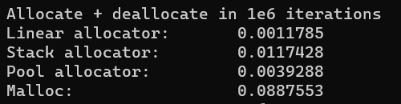

<h1>Кастомные аллокаторы</h1>
<hr>
<ul>
  <li>
    <h2>Линейный аллокатор</h2>
    Выделение памяти происходит за О(1), освобождение так же за О(1).
    Подобный эффект достигается откладыванием освобождения памяти до уничтожения аллокатора, т.е. выделенная этим аллокатором память освобождается только один раз - в деструкторе аллокатора. 
    Применяется в тех контейнерах, в которых заранее известно о малом числе хранимых в нем элементов.
  </li>
  <li>
    <h2>Стек-аллокатор</h2>
    Выделение памяти происходит за О(1), освобождение так же за О(1).
    Подобный эффект достигается за счет определенного порядка (LIFO) освобождение памяти. Применяется в тех контейнерах, в которых порядок освобождения памяти совпадает с порядком аллокатора.
  </li>
  <li>
    <h2>Pool-аллокатор</h2>
    Выделение памяти происходит за О(1), освобождение так же за О(1).
    Подобный эффект достигается за счет ограничения на выделяемый за раз память(все аллокации памяти заданного константного размера). Применяется в контейнерах, в которых размер выделяемой
    памяти не превышет заранее заданного порога.
  </li>
</ul>
<hr>
<h1>Результаты тестов:</h1>

<p>Тесты, очевидно, вообще не объективны, т.к. замерялось реальное время исполнение кода, а оно разниться от случая к случаю и от железа к железу, но прирост производительности тем не менее очевиден.</p>
<p>Объявление аллокатора имеет следующий вид</p>

```cpp
template <typename Type, typename MemoryType = MemoryLinear>
class Allocator
// Type - тип аллоцируемого объекта
// MemoryType - тип управления памятью (один из MemoryLinear, MemoryStack, MemoryPool)
```

<p>Для указания размера памяти удобно использовать MemoryUnit</p>

```cpp
alloc::MemoryUnit<1, alloc::KiB>::byte(); // 1024
alloc::MemoryUnit<2, alloc::MB>::kilobyte(); // 1000
...
```

<p>Объявление конструкторов</p>

```cpp
// Общий
Allocator(size_t byte_count = default_memory_size)

// Специализация шаблона для MemoryPool
Allocator(size_t byte_count = default_memory_size, size_t pool_h = default_pool_h)

// byte_count - общий размер памяти в байтах, необходимый для аллоцирования объектов
// pool_h - размер выделяемого блока памяти для Pool-аллокатора
```

<p>Выделение памяти по умолчанию можно задать макросами (обязательно перед включением заголовка)</p>

```cpp
#define DEFAULT_MEMORY_SIZE 20, KiB // Общий размер памяти, предназначенной для аллоцирования объектов
#define META_MEMORY_SIZE 1, KiB // Размер памяти для хранения узлов управляющих структур
#include "alloc.hpp"
```

<p>Пример создания контейнера с линейным аллокатором</p>

```cpp
std::vector<int, alloc::Allocator<int>> example;
```
