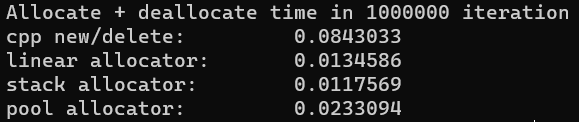

<h1>Кастомные аллокаторы</h1>
<hr>
<ul>
  <li>
    <h2>Линейный аллокатор</h2>
    Выделение памяти происходит за О(1), освобождение так же за О(1).
    Подобный эффект достигается откладыванием освобождения памяти до уничтожения аллокатора, т.е. выделенная этим аллокатором память освобождается только один раз - в деструкторе аллокатора. 
    Применяется в тех контейнерах, в которых заранее известно о малом числе хранимых в нем элементов.
  </li>
  <li>
    <h2>Стек-аллокатор</h2>
    Выделение памяти происходит за О(1), освобождение так же за О(1).
    Подобный эффект достигается за счет определенного порядка (LIFO) освобождение памяти. Применяется в тех контейнерах, в которых порядок освобождения памяти совпадает с порядком аллокатора.
  </li>
  <li>
    <h2>Pool-аллокатор</h2>
    Выделение памяти происходит за О(1), освобождение так же за О(1).
    Подобный эффект достигается за счет ограничения на выделяемый за раз память(все аллокации памяти заданного константного размера). Применяется в контейнерах, в которых размер выделяемой
    памяти не превышет заранее заданного порога.
  </li>
</ul>
<hr>
<h1>Результаты тестов:</h1>

<p>У каждого аллокатора есть версия static, которая производит все аллокации на стеке. Прирост в производительности аллокаций/деаллокаций равен нулю. Эти версии аллокаторов применяются в тех же случаях, что и обыкновенный линейный аллокатор, но с еще более жесткими требованиями к общему кол-ву доступной памяти. Преимуществом таких версий аллокаторов является скорость их инициализации за счет отстутствия системных вызовов.</p>
<p>Объявление аллокатора имеет следующий вид</p>
```
void f()
{
}
```
